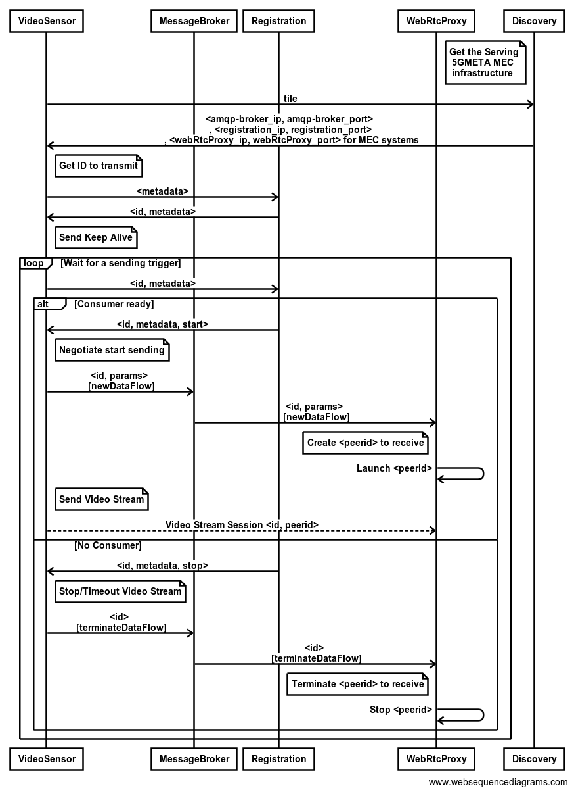

# Video Stream Broker

This repository provides the modules to push a video stream to the MEC infrastructure and how the Broker performs the signalling and the streaming of Video flows in a standard way.

Sensor and Device needs to follow these steps:

 1. Discover the serving MEC infrastructure
 2. Receive the IP address of the MEC infrastructure and the port of the serving AMQP message broker, Dataflow Registration and WebRTC Proxy services hosted there
 3. Register the available Video Stream including abstraction parameters of the video, timestamp, resolution, frames per second, encoding format, geolocation and connection attributes
 4. Receive a unique ID from the MEC
 5. Send Keep alive from time to time to provide presence availability
 6. Get notification, in response to keep alive, when sensor is expected to start or stop sending video stream
 7. Send the ID to the AMQP message broker to get the receiver at the MEC ready to establish a WebRTC session
 8. Start sending the video stream after the WebRTC negotiation
 9. Notify the end of Session when applicable

The accepted video formats to be pushed to the discovered 5GMETA MEC platform are:

 - V4L: to capture a camera compatible with V4L protocol
 - UDP: to capture a RTP with a H264 video
 - RTSP: to capture a RTSP with a H264 video

## Prerequisites
The prerequisites for the S&Ds to push a video stream are:
- ***From the Infrastructure***:
	- A **Kubernetes infrastructure** for the **5GMETA MEC** platform already **registered** at the 5GMETA Cloud Discovery service 
	- To have access to the 5GMETA Cloud platform Discovery service 
		- ***(it can be disabled initializing its URL to "" and results for local deployment and testing are hardcoded)***
	- To have a **AMQP/MQTT server** running **at** the discovered **5GMETA MEC platform**
- ***From Device***:
	- To have **compatible** video source
		- a camera **compatible** with **V4L**,
		- a **UDP url** with a **RTP video** flow using the **H264 encoder** OR an **RTSP url** with a RTSP video flow using the **H264 encoder**
- ***Dependencies***
	- The S&Ds can use the provided Docker or to natively include these requirements:

> PIP3 \
> connexion[swagger-ui] == 2.6.0 \
> python_dateutil == 2.6.0 \
> setuptools >= 21.0.0 \
> mysql-connector-python == 8.0.26  \
> paho-mqtt == 1.5.1 \
> docker == 4.1.0 \
> requests == 2.22.0 \
> pygeotile == 1.0.6 \
> websockets \
> PACKETS \
> gstreamer >= 1.18.5 \
> gstreamer1.0-rtsp \
> python3 \
> python3-pip \
> libjson-glib-1.0-0 \
> libjson-glib-dev \

## Video FORMATS

The accepted **video formats** to be pushed to the discovered **5GMETA MEC platform** are:

 - *V4L*: to capture a camera compatible with V4L protocol
 - *UDP*: to capture a RTP with a H264 video
 - *RTSP*: to capture a RTSP with a H264 video

The solution can be easily updated to HEVC and it can be enabled NVIDIA encoding/decoding acceleration instead of default software encoding

## Deployment

In the [`deploy`](./deploy/README.md) folder different instructions to operate and deploy the involved dockers.

For the deployment the modules to use are:
- **WebRTC Proxy** to receive the Video Stream in WebRTC format get the UDP stream and turning it into AMQP messages (1 per frame) ready to be processed by Pipelines running at the 5GMETA MEC infrastructure.
	- The instructions for that can be found in [`deploy`](./deploy/) folder while the code in [`src`](./src/) folder.
- **Video Sensor** to push a Video Stream to the 5GMETA MEC infrastrcuture. 
	- The instructions for that can be found in [`deploy`](./deploy/) folder while the code in [`src`](./src/) folder. 
	
* In the [`examples`](./examples/README.md) the instructions to run these dockers

## Authors

* Angel Martin ([amartin@vicomtech.org](mailto:amartin@vicomtech.org))
* Khaled Chikh ([khaledchikh@unimore.it](mailto:khaledchikh@unimore.it))

## License

Copyright : Copyright 2022 VICOMTECH

License : EUPL 1.2 ([https://eupl.eu/1.2/en/](https://eupl.eu/1.2/en/))

The European Union Public Licence (EUPL) is a copyleft free/open source software license created on the initiative of and approved by the European Commission in 23 official languages of the European Union.

Licensed under the EUPL License, Version 1.2 (the "License"); you may not use this file except in compliance with the License. You may obtain a copy of the License at [https://eupl.eu/1.2/en/](https://eupl.eu/1.2/en/)

Unless required by applicable law or agreed to in writing, software distributed under the License is distributed on an "AS IS" BASIS, WITHOUT WARRANTIES OR CONDITIONS OF ANY KIND, either express or implied. See the License for the specific language governing permissions and limitations under the License.
